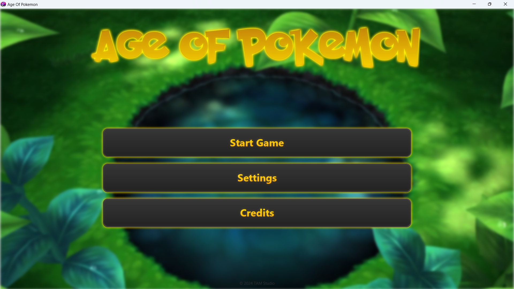
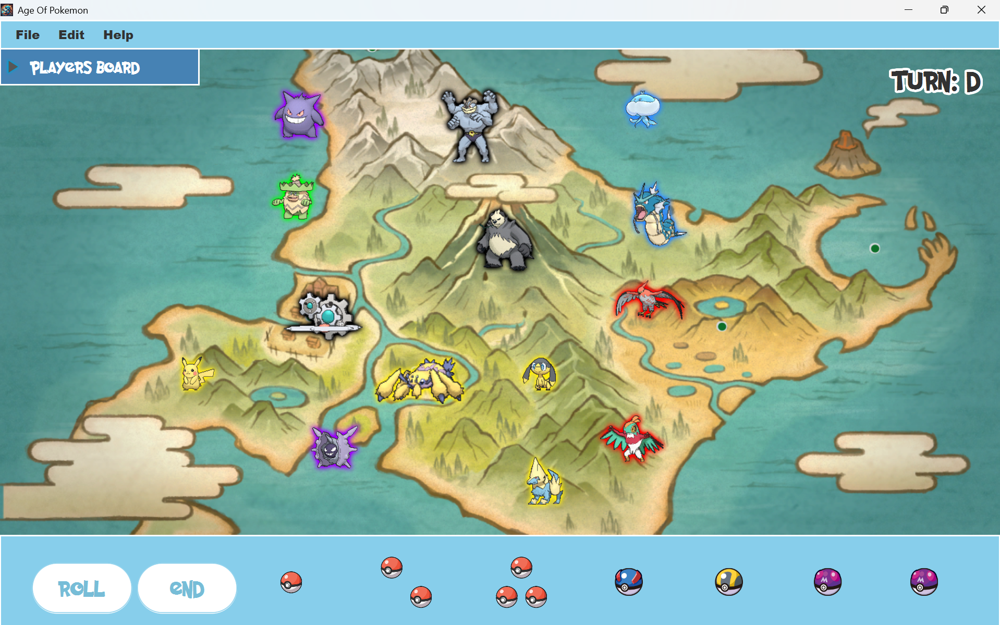

# Age of Pokemon - Game Development Project



## Executive Summary

**Age of Pokemon** is a Java-based strategy board game that combines the engaging gameplay mechanics of "Age of War" with the beloved Pokémon franchise. Developed as an Object-Oriented Programming project, this application showcases modern software engineering practices, clean architecture, and professional UI/UX design principles.

---

## Project Overview

### Description
Age of Pokemon is an interactive multiplayer board game where players compete to capture Pokémon, complete group collections, and strategically manage resources to achieve victory. The game features a rich graphical interface built with JavaFX, complete with animations, sound effects, background music, and video integration.

### Target Audience
- Pokémon enthusiasts of all ages
- Strategy game players
- Casual gamers seeking turn-based entertainment

### Project Type
Desktop Application (Windows executable with cross-platform Java source code support)

### Screenshots

#### Main Menu

*The game features an animated main menu with background video and smooth transitions*

#### Game Scene

*Interactive game board with Pokémon capture mechanics, dice rolling, and player tracking*

### Complete Documentation
📄 **[Full Project Report (PDF)](report/OOP_Java___AOP.pdf)** - Comprehensive documentation including design decisions, implementation details, and testing results

---

## Key Features

### Gameplay Mechanics
- **Turn-based Strategy**: Players take turns rolling dice and making strategic decisions
- **Pokémon Collection**: Capture and collect Pokémon with unique attributes and requirements
- **Group System**: Complete Pokémon groups for bonus points and strategic advantages
- **Dynamic Difficulty**: Multiple difficulty levels to accommodate various skill levels
- **Multiplayer Support**: 2-6 players can compete in a single game session

### Technical Features
- **Rich User Interface**: Modern JavaFX-based GUI with responsive design
- **Multimedia Integration**: Background music, sound effects, and video playback
- **Persistent Data**: JSON-based data storage for game state and Pokémon database
- **Custom Graphics**: Original artwork and assets for immersive gameplay
- **Smooth Animations**: Professional transitions and visual effects
- **Resource Management**: Efficient asset loading and memory management
- **Settings Management**: Configurable audio, video, and gameplay settings

---

## Technical Architecture

### Technology Stack

#### Core Technologies
- **Java 23**: Primary programming language
- **JavaFX 23**: UI framework for rich desktop applications
- **Maven**: Build automation and dependency management
- **Launch4j**: Native Windows executable generation

#### Key Libraries & Dependencies
```xml
- org.openjfx:javafx-controls:23
- org.openjfx:javafx-fxml:23
- org.openjfx:javafx-media:23
- com.fasterxml.jackson.core:jackson-databind:2.15.2
- com.fasterxml.jackson.core:jackson-annotations:2.15.2
- com.fasterxml.jackson.core:jackson-core:2.15.2
```

### Architecture Pattern
The application follows the **Model-View-Controller (MVC)** architectural pattern:


*Simplified class diagram showing the main components and their relationships*

- **Models** (`misc/` package): Core business logic and data structures
  - `Pokemon`: Pokémon entity with attributes and behaviors
  - `Player`: Player state management
  - `Group`: Pokémon group collections
  - `Requirement`: Game progression requirements

- **Views** (FXML files in `resources/`): UI layouts and styling
  - Main menu, game board, registration, settings, results
  - CSS styling for consistent visual design

- **Controllers** (controller packages): Application logic and event handling
  - `GameController`: Main gameplay logic
  - `MenuController`: Main menu navigation
  - `RegisterController`: Player registration
  - `SettingsController`: Application settings
  - `DiceController`: Dice rolling mechanics
  - `ResultDisplay`: End game results

### Project Structure
```
aop/
├── src/
│   ├── main/
│   │   ├── java/com/example/
│   │   │   ├── App.java                    # Application entry point
│   │   │   ├── Main.java                   # Main class
│   │   │   ├── capture/                    # Media capture components
│   │   │   ├── game/                       # Core gameplay controllers
│   │   │   ├── help/                       # Help system
│   │   │   ├── menu/                       # Main menu
│   │   │   ├── misc/                       # Models and utilities
│   │   │   ├── register/                   # Player registration
│   │   │   ├── result/                     # Game results display
│   │   │   └── settings/                   # Settings management
│   │   └── resources/com/example/
│   │       ├── assets/                     # Game assets (see note below)
│   │       │   ├── balls/                  # Pokéball graphics
│   │       │   ├── bgm/                    # Background music
│   │       │   ├── font/                   # Custom fonts
│   │       │   ├── soundeffect/            # Sound effects
│   │       │   ├── stocks/                 # Pokémon images
│   │       │   └── voice/                  # Voice files
│   │       ├── capture/                    # Capture UI FXML
│   │       ├── game/                       # Game UI FXML & CSS
│   │       ├── menu/                       # Menu UI FXML & CSS
│   │       ├── register/                   # Registration UI
│   │       ├── result/                     # Results UI
│   │       └── settings/                   # Settings UI
│   └── test/                               # Unit tests (if applicable)
├── pom.xml                                  # Maven configuration
├── launch4j.xml                             # Windows executable config
├── README.md                                # User documentation
├── COMPANY_README.md                        # This document
├── assets.zip                               # Compressed assets (not in repo)
└── report/                                  # Project documentation
    ├── OOP_Java___AOP.pdf                   # Full project report
    ├── aopmenu.png                          # Menu screenshot
    ├── game_scene.png                       # Game screenshot
    └── aop_class.png                        # Class diagram
```

> **📦 Note on Assets**: Due to the large size of multimedia assets (images, audio, video), the `assets/` folder is not included in the GitHub repository. 
> 
> **Download Assets**: `assets.zip` is available on Google Drive: [Download Link]
> 
> After downloading, extract the contents to `src/main/resources/com/example/assets/` to run the application from source.

---

## Core Components

### Game Systems

#### 1. Player Management System
- Player registration with customizable settings
- Turn-based rotation system
- Score tracking and resource management
- Player state persistence

#### 2. Pokémon Database System
- JSON-based Pokémon database with extensible schema
- Dynamic loading of Pokémon attributes
- Group categorization (e.g., starters, legendaries, etc.)
- Requirement validation system

#### 3. Dice Mechanics
- Configurable dice rolling system
- Visual dice animation
- Random number generation with fair distribution
- Turn progression logic

#### 4. Capture System
- Requirement-based Pokémon capture mechanics
- Success/failure validation
- Ownership tracking
- Group completion detection

#### 5. Audio System (`SoundManager`)
- Background music playback with looping
- Sound effect management
- Volume control
- Audio resource lifecycle management

#### 6. UI Components
- Responsive layouts that adapt to screen resolution
- Custom styled components matching Pokémon theme
- Animation system for smooth transitions
- Modal dialogs for game events

---

## Development Highlights

### Object-Oriented Design Principles

1. **Encapsulation**: Data and methods are properly encapsulated within classes
2. **Inheritance**: Logical class hierarchies for code reuse
3. **Polymorphism**: Flexible component design through interfaces
4. **Abstraction**: Complex systems hidden behind simple interfaces

### Design Patterns Implemented
- **MVC Pattern**: Separation of concerns for maintainability
- **Singleton Pattern**: Sound manager and utility classes
- **Factory Pattern**: Dynamic UI component creation
- **Observer Pattern**: Event-driven UI updates

### Code Quality
- Comprehensive JavaDoc documentation
- Consistent naming conventions
- Modular architecture for easy maintenance
- Error handling and input validation
- Resource cleanup and memory management

---

## System Requirements

### Minimum Requirements
- **OS**: Windows 10/11 (or any OS with Java 23 support)
- **RAM**: 4 GB
- **Processor**: Intel i3 or equivalent
- **Storage**: 4 GB free space
- **Display**: 1280x720 resolution minimum

### Recommended Requirements
- **RAM**: 8 GB or higher
- **Processor**: Intel i5 or equivalent
- **Display**: 1920x1080 resolution or higher

---

## Installation & Deployment

### For End Users (Windows)
1. Download the application package containing `AgeOfPokemon.exe`
2. Ensure the bundled JRE folder is present in the same directory
3. Double-click `AgeOfPokemon.exe` to launch

### For Developers

#### Prerequisites
- Java Development Kit (JDK) 23
- Maven 3.6 or higher
- IDE with JavaFX support (IntelliJ IDEA, Eclipse, or VS Code)

#### Building from Source
```bash
# Clone the repository
git clone [repository-url]
cd aop

# Download and extract assets
# Download assets.zip from Google Drive: [Download Link]
# Extract to: src/main/resources/com/example/assets/

# Build with Maven
mvn clean install

# Run the application
mvn javafx:run
```

> ⚠️ **Important**: The application requires the assets folder to run. Download `assets.zip` from Google Drive and extract it to the correct location before building.

#### Generating Executable
The project includes Launch4j configuration for creating Windows executables:
```bash
# Use Launch4j with the provided launch4j.xml configuration
launch4j launch4j.xml
```

---

## Project Management

### Development Team
- **Viet Tin Le** (ID: 1585762)
- **That Nhat Minh Ton** (ID: 1588341)
- **Tri An Yamashita** (ID: 1590012)

### Development Timeline
- **Project Duration**: Winter Semester 2024/2025
- **Release Version**: 1.0
- **Release Date**: February 1, 2025

### Version Control
The project uses Git for version control with organized commit history and branch management.

---

## Testing & Quality Assurance

### Testing Approach
- Manual testing of all game scenarios
- UI/UX testing across different screen resolutions
- Performance testing for resource-intensive operations
- Cross-platform compatibility verification

### Known Issues & Future Enhancements
_(This section can be expanded based on project status)_

---

## Documentation

### Available Documentation
- **[OOP_Java___AOP.pdf](report/OOP_Java___AOP.pdf)**: Complete project report with detailed analysis
- **README.md**: User installation and execution guide
- **COMPANY_README.md**: Technical and business overview (this document)
- **JavaDoc Comments**: Inline code documentation
- **FXML Files**: UI structure documentation
- **Screenshots**: Visual documentation in `report/` folder

### Code Comments
All major classes include:
- Class-level documentation
- Method-level descriptions
- Parameter and return value documentation
- Author information and version history

---

## Business Value

### Technical Achievements
- Full-stack Java application development
- Professional UI/UX design
- Multimedia integration
- Cross-platform compatibility
- Efficient resource management

### Learning Outcomes
- Object-Oriented Programming mastery
- JavaFX framework expertise
- Software architecture design
- Project management and teamwork
- Version control and collaboration

### Scalability Potential
The modular architecture allows for:
- Easy addition of new Pokémon
- New game modes and features
- Online multiplayer capabilities
- Mobile platform adaptation
- Localization for international markets

---

## Dependencies & Licensing

### External Dependencies
All dependencies are managed through Maven and use permissive licenses:
- JavaFX: GPL v2 with Classpath Exception
- Jackson: Apache License 2.0

### Third-Party Assets
- Pokémon-related assets are used for educational purposes
- Custom fonts and graphics created for this project

---

## Contact & Support

### Academic Context
This project was developed as part of an Object-Oriented Programming course at [University Name], Winter Semester 2024/2025.

### Development Team Contact
For technical inquiries or project demonstrations:
- Viet Tin Le (1585762)
- That Nhat Minh Ton (1588341)
- Tri An Yamashita (1590012)

---

## Conclusion

**Age of Pokemon** demonstrates professional software development practices, combining technical excellence with engaging gameplay. The project showcases strong object-oriented design, clean architecture, and attention to detail in both functionality and user experience. This application represents a complete, polished product suitable for portfolio demonstration and further development.

### Key Takeaways
✅ Professional desktop application development with Java  
✅ Modern UI/UX design with JavaFX  
✅ Clean, maintainable code architecture  
✅ Complete game logic implementation  
✅ Multimedia integration  
✅ Cross-platform compatibility  
✅ Comprehensive documentation  
✅ Team collaboration and version control  
